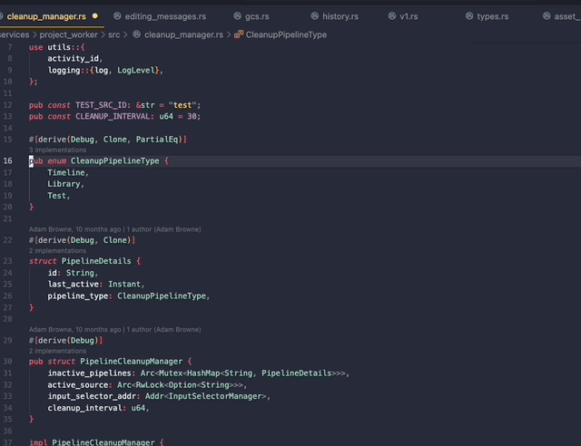

# Prompt Memory

"Prompt Memory" allows you to save and reuse prompts in Cursor.
You can then add keyboard shortcuts to quickly access and execute them. This is useful if you have a lot of frequently used prompts; such as formatting code, adding documentation, or adding tests. **Any wasted keystroke is a waste of time**.

## Note

- This is not an official Cursor extension. It is not affiliated with the Cursor team. It is simply to make some people's lives easier, since often they have to use the same prompts over and over again. You could also use *expanso*, which I highly recommend for text-expansion, throughout your workflow.

## Features

- Save frequently used prompts
- Add keyboard shortcuts to prompts
    (This is done by adding a command to your `keybindings.json` file)
    You should search for the command and then you can add keybindings.
    - This allows you to recall and execute prompts later
- **Note**: Since cursor doesn't expose the `Submit Edit` command externally, this will not execute the prompt. You must still do that. If you wanted, you could chain the keyboard shortcuts you make with a third party tool to fire the enter key afterwards.

## Usage Instructions

- You can either open the command palette and search for "Manage Prompt Shortcuts" to open the shortcut manager or, the preferred method of using the hotkey, `cmd+shift+e`. That is configurable in the editor settings.

For example if there is an image subfolder under your extension project workspace:

## WIP 

- Better file support with composer prompts; the ability to have cursor recognize the file you've mentioned in the prompt.

## Release Notes

### 1.0.0

Initial release of Prompt Memory.